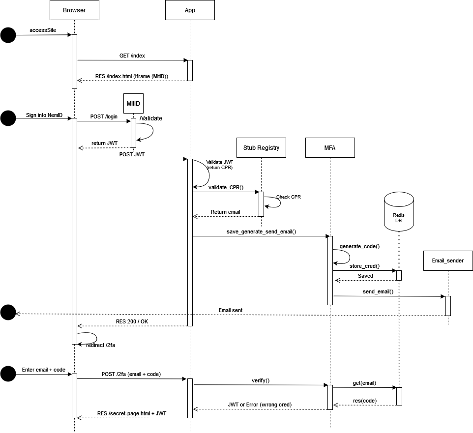
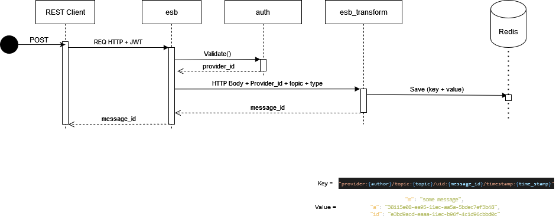

# SI_mandatory

### Prerequisites:

- Docker & Docker-compose
- Python3 & VENV
- Cloned the repo

On ubuntu run `bash run.sh`

You need a `.env` file with the following env vars:

```
jwt_secret=
algorithm=
sender_email=
sender_password=
stub_receiver_email=
port=
redis_port=
redis_pass=
mitid_url=https://mitid.eu.pythonanywhere.com/

```

#### To setup the project:

```
$ cd /SI_mandatory
$ docker-compose up -d
$ pip install -r ./requirements.txt
```

#### To run the project:

```
$ python app.js
$ python esb.js
```

## SD of AUTH



## SD of ESB


