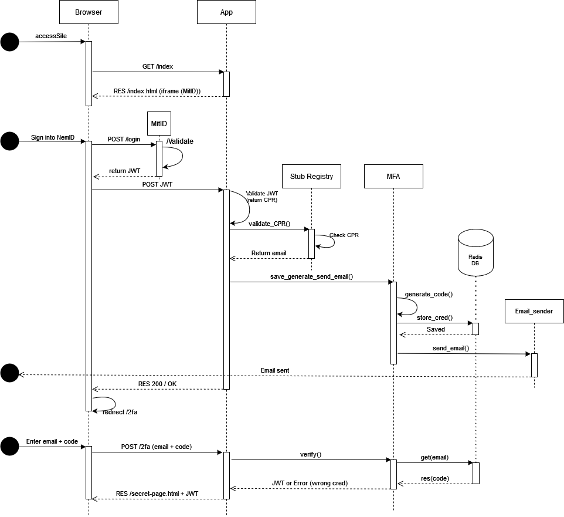

# SI_mandatory

### Prerequisites:
- Docker & Docker-compose
- Python3 & VENV

On ubuntu run `bash run.sh`

You need a `.env` file with the following env vars:
```
jwt_secret=
algorithm=
sender_email=
receiver_email=
sender_password=
port=
mitid_url=
```

#### To setup the project:
```
$ cd /SI_mandatory
$ docker-compose up -d 
$ pip install -r ./requirements.txt
```

#### To run the project:
```
$ python app.js
$ python esb.js 
```


## SD of AUTH

## SD of ESB


